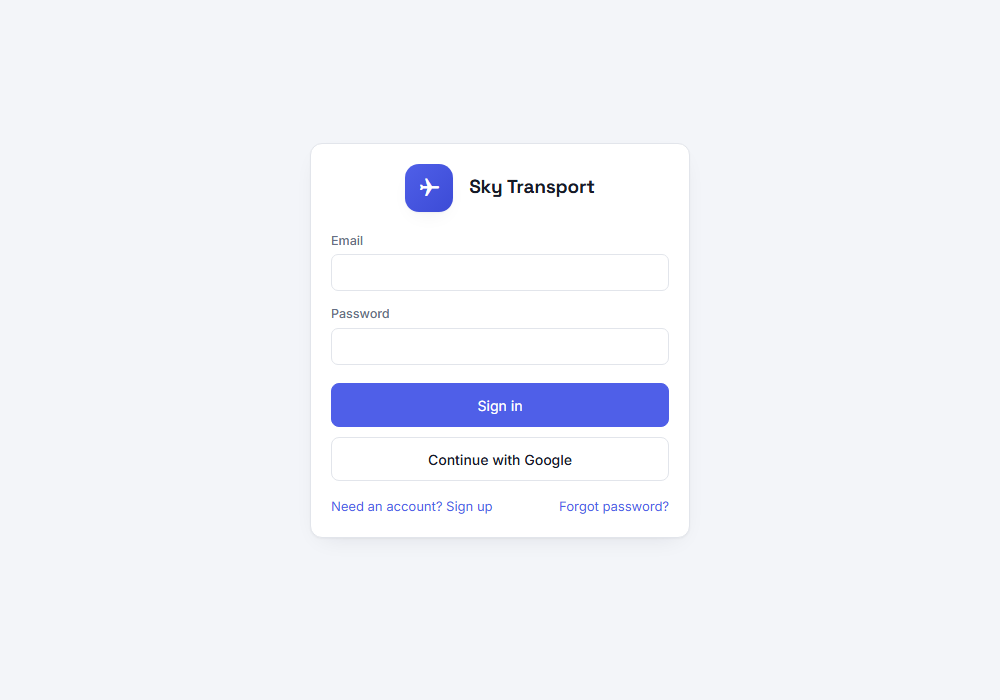
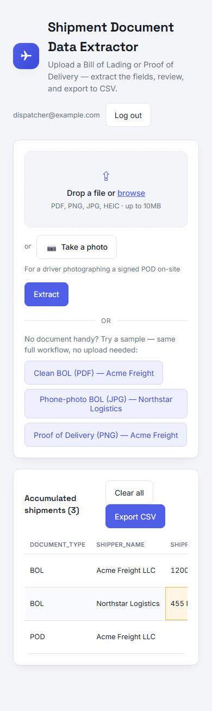
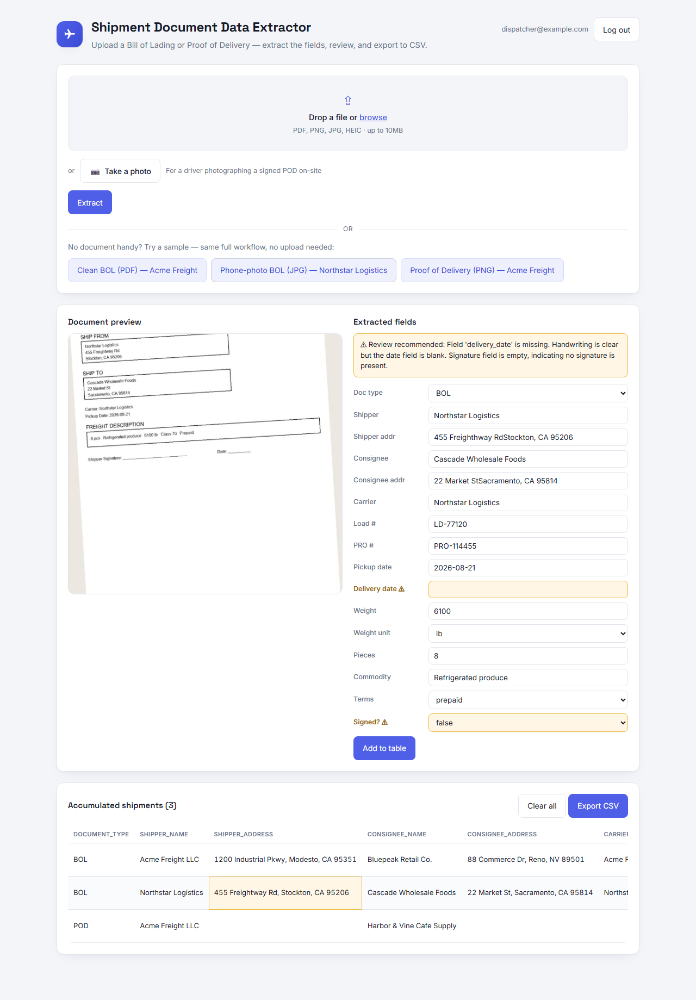
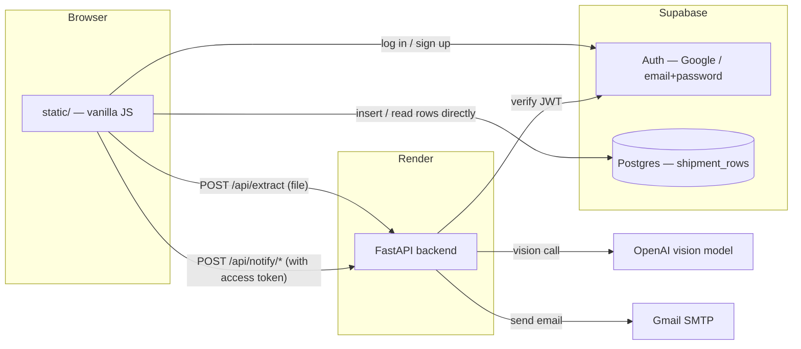

<div align="center">

# ✈ Sky Transport — Shipment Document Data Extractor

**Upload a Bill of Lading (BOL) or Proof of Delivery (POD) — get structured shipment data back in seconds, no manual retyping.**

[](https://sky-transport-project.vercel.app)

[](https://github.com/SiddharthBhamare01/Sky_transport_project/actions/workflows/ci.yml)
[](LICENSE)
[](requirements.txt)
[](app/main.py)
[](https://supabase.com/)
[](app/extractor.py)
[](https://sky-transport-project.onrender.com)

**[🚀 Live app](https://sky-transport-project.vercel.app)** · **[⚙ API (Render)](https://sky-transport-project.onrender.com)** · Built for the Sky Transport Solutions technical assessment, **AUTOMATE** track

</div>

> The API is hosted on Render's free tier, which spins down after inactivity — the **first** request after a period of idle time can take up to ~50 seconds to wake back up. The app tells you this is happening ("Waking up server…") rather than looking frozen.

## Screenshots

<table>
<tr>
<td width="50%">

**Sign in** — email/password or Google, via Supabase Auth



</td>
<td width="50%">

**Mobile** — camera capture, HEIC support, ~44px touch targets



</td>
</tr>
</table>

**Extraction results** — per-field low-confidence flagging in action: `delivery_date` and `signature_present` are highlighted because the source document doesn't clearly show them, with a plain-language explanation banner. The shared queue below shows the same flag carried through to a saved row.



## Table of contents

- [Screenshots](#screenshots)
- [What it does](#what-it-does)
- [Features](#features)
- [Tech stack](#tech-stack)
- [Architecture](#architecture)
- [Quick start (local dev)](#quick-start-local-dev)
- [Environment variables](#environment-variables)
- [Deployment](#deployment)
- [Project structure](#project-structure)
- [Testing](#testing)
- [Security notes](#security-notes)
- [Why this design](#why-this-design)
- [Known limitations / next steps](#known-limitations--next-steps)
- [Problem / Idea / Implementation / Result / Learning](#problem--idea--implementation--result--learning)
- [License](#license)

## What it does

1. Upload a BOL/POD as a PDF or photo (drag-and-drop, file browser, or straight from the camera on a phone), or pick a sample document.
2. The document is sent to an OpenAI vision model constrained to a fixed JSON schema (shipper, consignee, load #, dates, weight, commodity, etc.) — the response always has a predictable shape, no free-text parsing.
3. Extracted fields appear in an editable form next to the document preview. Fields the model couldn't read confidently are individually flagged for review, not just one generic banner.
4. Confirm (and correct, if needed) the fields, then **Add to table** — the row is saved to a shared queue everyone on the team can see.
5. Export the accumulated table as a CSV ready to paste into a spreadsheet.

## Features

- **LLM-based extraction** with a strict JSON schema (`app/schema.py`) — no brittle OCR/regex templates.
- **Three ways to get a document in**: drag-and-drop, file browser, or a dedicated camera-capture button for mobile field use (`capture="environment"`).
- **HEIC/HEIF support** — the default photo format on iPhones, transcoded server-side before extraction.
- **Per-field low-confidence flagging**, not just one document-level flag — see [The Result](#problem--idea--implementation--result--learning) for an honest account of how well this actually works.
- **Accounts and a shared queue** — Google or email/password sign-in (Supabase Auth), password reset, and a Postgres-backed table every logged-in user shares.
- **Transactional email notifications** (welcome on signup, password-changed confirmation, shipment-added summary) sent via Gmail over OAuth2 — never to a free-text recipient (see [Security notes](#security-notes) for why).
- **Sample mode** — three fixture documents let anyone demo the full workflow with zero API calls and no credentials.
- **CSV export**, client-side, ready to paste into a spreadsheet.
- **Mobile-first fixes**: ~44px touch targets, offline/slow-network-aware error messages, and loading feedback for Render's cold start.

## Tech stack

| Layer | Choice |
|---|---|
| Backend | Python, [FastAPI](https://fastapi.tiangolo.com/), Uvicorn |
| Extraction | OpenAI vision model (`gpt-4o-mini` by default), structured JSON-schema output |
| Document handling | PyMuPDF (PDF → image), Pillow + pillow-heif (HEIC → PNG) |
| Frontend | Vanilla HTML/CSS/JS — no build step, no framework |
| Auth & database | [Supabase](https://supabase.com/) (Postgres + Auth: Google OAuth and email/password) |
| Email | Gmail SMTP via OAuth2 (XOAUTH2), verified with a Supabase JWT server-side |
| Hosting | [Render](https://render.com/) (backend API), [Vercel](https://vercel.com/) (static frontend) |
| CI | GitHub Actions — backend import/compile check, frontend JS syntax check |

## Architecture



The frontend talks to Supabase **directly** for data (auth, reading/writing `shipment_rows`) using a public, RLS-protected key — the FastAPI backend stays stateless and is only responsible for two things: calling OpenAI, and sending the three notification emails (which need secrets that must never reach the browser).

## Quick start (local dev)

```bash
python -m venv .venv
.venv/Scripts/activate        # Windows; use `source .venv/bin/activate` on macOS/Linux
pip install -r requirements.txt

cp .env.example .env
# edit .env and set OPENAI_API_KEY=... to enable live extraction (optional)

uvicorn app.main:app --reload --port 8811
```

Open http://127.0.0.1:8811 in a browser.

**No API key? The app still fully works.** Click any of the three "try a sample" buttons — they exercise the entire preview → edit → table → CSV export flow using pre-loaded example documents, with zero API calls. A banner on the page tells you which mode you're in. (Note: the shared queue itself requires signing in, since it's backed by Supabase — sample-mode extraction does not.)

## Environment variables

**Backend (Render dashboard / local `.env`)**

| Variable | Required | Purpose |
|---|---|---|
| `OPENAI_API_KEY` | For live extraction | OpenAI API key. Without it, only sample mode works. |
| `OPENAI_MODEL` | No (default `gpt-4o-mini`) | Which OpenAI model to call. |
| `SUPABASE_JWT_SECRET` | For email notifications | Verifies a caller's Supabase session before sending an email — prevents the notify endpoints being used to spam arbitrary addresses. |
| `GOOGLE_CLIENT_ID` / `GOOGLE_CLIENT_SECRET` | For email notifications | OAuth2 client used to mint a Gmail access token. |
| `GMAIL_REFRESH_TOKEN` | For email notifications | Long-lived token for the Gmail account that sends notifications. |
| `GMAIL_SENDER_EMAIL` | For email notifications | The Gmail address tied to the refresh token above. |

**Frontend (`static/config.js`, committed — these are intentionally public)**

| Variable | Purpose |
|---|---|
| `RENDER_ORIGIN` | Base URL of the deployed backend the browser calls. |
| `SUPABASE_URL` / `SUPABASE_KEY` | Supabase project URL and **publishable** (anon) key — safe to expose client-side; access is enforced by Row Level Security, not by hiding this key. |

## Deployment

This repo is already wired up for continuous deployment:

- **Render** auto-deploys the backend from `main` (build: `pip install -r requirements.txt`; start: `uvicorn app.main:app --host 0.0.0.0 --port $PORT`).
- **Vercel** auto-deploys the frontend from `main`, with the project's Root Directory set to `static/` (no build step).
- **Supabase** hosts the Postgres database and handles authentication; the `shipment_rows` table is shared across all signed-in users (see [Security notes](#security-notes)).
- **GitHub Actions** (`.github/workflows/ci.yml`) runs on every push/PR — a build/syntax gate, separate from the deploy which happens natively via Render/Vercel's GitHub integration.

## Project structure

```
app/                    FastAPI backend
  main.py               Routes: /api/extract, /api/notify/*, static file serving
  extractor.py          OpenAI vision call, PDF/HEIC → image conversion
  notify.py             JWT verification + Gmail SMTP (OAuth2) sending
  schema.py             The strict JSON schema extraction is constrained to
  sample_mode.py        Canned results for the three demo fixtures
  config.py             Environment variable loading

static/                 Frontend — vanilla HTML/CSS/JS, no build step
  index.html / app.js   Main extractor UI
  login.html            Sign in / sign up / forgot password
  reset-password.html   Landing page for the emailed password-reset link
  auth.js               Supabase Auth helper functions
  config.js             Public runtime config (Supabase + backend URL)

samples/                Fixture documents used by the "try a sample" buttons
test-samples/           Manual test PDFs + a QA guide for exercising the live extraction path
.github/workflows/      CI
```

## Testing

- `.github/workflows/ci.yml` runs on every push/PR: installs backend dependencies and confirms the app imports cleanly, and syntax-checks the frontend JS.
- `test-samples/` contains three fictional Bill-of-Lading PDFs (distinct from the built-in demo fixtures, which never call OpenAI) for manually exercising the **live** upload → extract path, plus a README and a generated `QA_Test_Fixtures_Guide.pdf` documenting expected field values for each.
- No automated end-to-end test suite yet — extraction quality was verified manually against known ground truth during development (see [The Result](#problem--idea--implementation--result--learning) for a specific, honest example of where it fell short).

## Security notes

- **Row Level Security, not obscurity.** The Supabase key shipped in `static/config.js` is the public "publishable" key — safe to expose, because access is enforced by a Postgres RLS policy (`authenticated` role only) rather than by keeping the key secret.
- **No free-text email recipients, anywhere.** Every notification email goes only to the token's own verified address — never a recipient the caller can specify — specifically to avoid the app's Gmail sender being used to email arbitrary third parties.
- **Every notify endpoint verifies the caller's Supabase JWT** server-side (`app/notify.py`) before sending anything, using `SUPABASE_JWT_SECRET` — it isn't enough to just know the endpoint exists.
- **Secrets live only in Render's environment variables** — `.env` is git-ignored, and nothing server-side is hardcoded into the repo.

## Why this design

**LLM extraction instead of OCR + regex.** BOL layouts vary by shipper and
carrier, and real-world input includes handwriting and skewed phone photos.
A regex/template pipeline would need a lot of hardening to handle that
variety; a schema-constrained multimodal call generalizes across layouts
through the prompt alone, and was far faster to get working correctly in
the time available. OpenAI's structured-output (`response_format:
json_schema`, strict mode) is used in `app/extractor.py` rather than
free-text parsing, so a malformed response isn't a possible failure mode.
`gpt-4o-mini` was chosen deliberately over a larger model — this is a
bounded, single-turn, schema-constrained read of a form, not open-ended
reasoning, so a smaller/cheaper model is accurate enough while keeping
per-document cost low (the model is configurable via `OPENAI_MODEL` in
`.env`).

**Null over guessing.** The extraction prompt explicitly instructs the model
to output `null` rather than invent a value it isn't confident about, and to
set a `review_recommended` flag with an explanation when something is
uncertain. Every field is editable before it's added to the table — a human
confirms the data, the model doesn't get the last word.

**Per-field confidence, and why it's framed around legibility, not
confidence.** The first version only had one document-level
`review_recommended` boolean. Real testing (see "The Result") showed that
flag missing a genuine misread — the model was simply wrong, not uncertain,
so asking it to self-report "confidence" was never going to catch that
specific failure. The fix implemented instead: `low_confidence_fields`, a
list of field names the model should populate whenever the *source text* for
a field isn't crisply legible (handwriting, blur, glare, low resolution) —
regardless of whether it still produced a plausible-looking value. That's a
legibility test, not a confidence test, on the theory that "would a human
need to double-check the source to be sure" is a more checkable question for
the model than "how sure are you." The UI highlights those specific fields
(in the form and, once added, in the table) instead of relying on one
document-level banner. Whether this framing actually worked better is
answered honestly (not favorably) in "The Result."

**Accounts exist to make notifications safe, not as an end in themselves.**
The original build deliberately shipped with no database and no auth — the
backend was stateless per request and the browser held rows in
`localStorage`. That changed once a "notify someone when a row is added"
feature was wanted: with no accounts, there's no legitimate address to
notify, and a free-text recipient field would let one user's actions email
an arbitrary, non-consenting third party using the app's own Gmail sender.
Adding real accounts (Google + email/password via Supabase Auth) solved
this cleanly — every row now has a genuine, verified owner, so a
notification can safely target "the row's own creator" instead of an
arbitrary string. The queue itself is still fully shared among every signed-in
user, matching the original intent of "a small database so multiple
dispatchers share one queue."

**Sample mode.** `/api/config` reports whether a server has an API key
configured, and the frontend shows a banner if not. Three fixtures ship in
`samples/` (fictional companies — "Acme Freight LLC" etc., not any real
carrier), generated by `samples/generate_samples.py` using `reportlab` and
`Pillow`; one is deliberately skewed and noise-added to simulate a phone
photo. This means the demo works even without network access or a live key.

> **Provenance:** `app/sample_mode.py`'s canned results are genuine frozen
> output from a real call to `app/extractor.py` against each fixture — not
> hand-authored. Sample mode only skips the network call at request time;
> the extraction logic is identical either way. These were re-run after the
> `low_confidence_fields` feature was added (see below), and the second run
> is what's frozen now — including its unresolved rough edges. See "The
> Result" for what that surfaced.

## Known limitations / next steps

- Single/small documents only — no multi-page batch handling.
- Per-field confidence flagging (`low_confidence_fields`) was added after the
  original single-flag design missed a real misread (see "The Result"), but
  testing after adding it showed it's not a full fix either: the specific
  address misread still isn't flagged, and the model conflates "field
  legitimately absent from this document type" with "field present but
  illegible" (e.g. it flagged 6 fields on the POD as low-confidence that
  simply don't exist on a POD by design). A second verification pass, or
  separating "structurally not applicable" from "illegible" in the schema
  itself, would be the next iteration rather than trusting this flag as-is.
- PDF preview uses an `<iframe>`; browsers without a built-in PDF viewer
  fall back to an "Open PDF in new tab" link.
- No mobile "card view" for the shared table yet — on a narrow phone screen
  it's a horizontally-scrollable wide table rather than a stacked layout.
  Real gap, deliberately deferred as a bigger redesign.
- No offline draft persistence — if a backgrounded mobile tab is discarded
  by the OS mid-review, in-progress (not-yet-saved) field edits are lost.
- Session-expiry mid-review surfaces as a generic save error rather than an
  automatic re-login prompt that preserves the in-progress review.
- With more time: batch upload, duplicate/date-sanity validation against
  existing rows, and a direct export/integration into whatever system the
  dispatch team already uses instead of a CSV hop.

---

## Problem / Idea / Implementation / Result / Learning

**The Problem.** At a small trucking/logistics operator, dispatchers
regularly retype the same handful of fields — shipper, consignee, load
number, dates, weight — off of BOL and POD paperwork (PDFs from carriers,
or phone photos taken at the dock) into a tracking spreadsheet. It's the
same few minutes of manual copying per document, several times a day, and
it's exactly the kind of repetitive task that's easy to get wrong under
time pressure (a transposed digit on a load number is a real problem when
someone goes looking for that shipment later).

**The Idea.** Rather than build a rigid template-matching OCR pipeline
(brittle across different carriers' document layouts, and slow to harden
in the time available), use a multimodal LLM call constrained to a fixed
JSON schema. That gets layout-agnostic extraction "for free" via prompting,
while a strict schema keeps the output predictable enough to build a UI
around. The design leans on keeping a human in the loop — the model is
told to say "I don't know" rather than guess, and every field stays
editable before anything is saved.

**The Implementation.** FastAPI backend (`app/`) + a small vanilla-JS
frontend (`static/`), no build tooling. One endpoint (`POST /api/extract`)
does the extraction, either against a real uploaded file or a canned sample.
Three synthetic sample documents were generated so the tool is fully
demoable without needing real (and likely sensitive) shipment paperwork.
State started out client-side only for a short-lived demo; accounts and a
shared Supabase-backed queue were added afterward, once notification
delivery needed a real, verified recipient (see "Why this design" above).

**The Result.** All three sample documents were run through the real
pipeline (`gpt-4o-mini`, live API key, not mocked) twice — once with the
original single-flag design, once after adding `low_confidence_fields`.

*Run 1 (single `review_recommended` flag):* the clean printed PDF
(`bol_acme_freight.pdf`) extracted perfectly. The POD also extracted
cleanly, correctly leaving fields not present on a POD as `null`. The
noisy/skewed "phone photo" fixture is where it broke: the model misread
"Freightway Rd" as "Freighthay Rd" and did **not** set `review_recommended`
to flag it — a dispatcher trusting that flag would have missed a bad row.

*Run 2 (after adding `low_confidence_fields`, meant to fix exactly that):*
the clean PDF still extracted perfectly with nothing flagged. But the fix
didn't fully work — on a re-run of the noisy photo, the model produced yet
another misread of the same street name ("Freighthway Rd" this time, a
third variant across runs, confirming the model is non-deterministic here)
and again did **not** flag `shipper_address` as low-confidence. Separately,
on the POD it *over*-flagged: 6 fields it correctly left `null` (because
they're not on a POD at all) were also listed in `low_confidence_fields`,
conflating "structurally absent" with "illegible." So the feature changed
the failure mode without eliminating it — it's honestly a partial result,
not a fixed one. [Add your own take: given this, would you trust this app's
review flag today, and what's the one change you'd make first — a second
verification pass on flagged fields, splitting "not applicable" from
"illegible" in the schema, or something else?]

**The Learning.** [Fill in: what you learned about prompting for structured
extraction, the OCR-vs-LLM tradeoff, and what you'd do differently — plus a
rough business-impact estimate, e.g. minutes saved per document × documents
per day for a small dispatch team.]

---

## License

[MIT](LICENSE) — see the LICENSE file for details.
