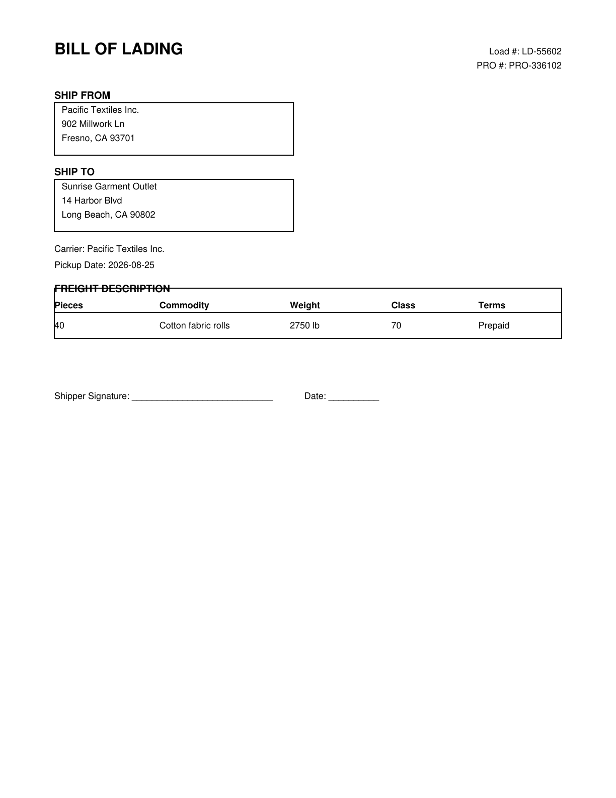
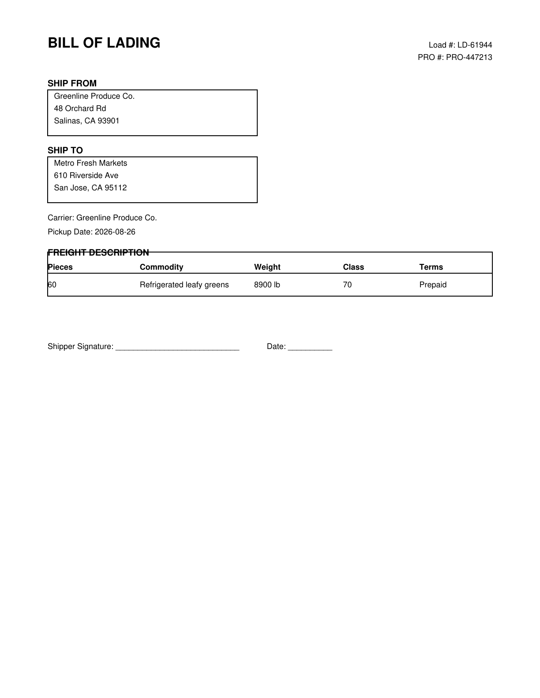

# Manual test fixtures

Three fictional Bill-of-Lading PDFs for exercising the **live** upload → extract path end to end (`POST /api/extract` with a real file, calling OpenAI) — as opposed to the built-in "try a sample" buttons in the app, which replay canned results from `app/sample_mode.py` without calling OpenAI at all.

Generated with the same `reportlab`-based generator as `../samples/` (see `../samples/generate_samples.py`); regenerate the PNG previews below with `python test-samples/_make_previews.py` if the PDFs ever change.

## How to use these

1. Open the deployed app and log in.
2. Drop one of these PDFs into the upload dropzone (or click "browse") and hit **Extract**.
3. Compare the extracted fields shown in the form against the "Expected fields" table below for that file — this checks the live OpenAI extraction path is working correctly, not just the demo/sample-mode path.
4. Click **Add to table** to also exercise the Supabase insert + "shipment added" notification email.

---

## 1. Summit Hardware Supply → Redwood Building Co.

| Field | Expected value |
|---|---|
| Document type | BOL |
| Shipper | Summit Hardware Supply, 310 Foundry Ave, Boise, ID 83702 |
| Consignee | Redwood Building Co., 77 Timberline Rd, Eugene, OR 97401 |
| Carrier | Summit Hardware Supply |
| Load # | LD-30871 |
| PRO # | PRO-220198 |
| Pickup date | 2026-08-24 |
| Weight | 5400 lb |
| Pieces | 18 |
| Commodity | Steel fasteners, boxed |
| Freight terms | Prepaid |
| Signature present | No (unsigned line) |

## 2. Pacific Textiles Inc. → Sunrise Garment Outlet

| Field | Expected value |
|---|---|
| Document type | BOL |
| Shipper | Pacific Textiles Inc., 902 Millwork Ln, Fresno, CA 93701 |
| Consignee | Sunrise Garment Outlet, 14 Harbor Blvd, Long Beach, CA 90802 |
| Carrier | Pacific Textiles Inc. |
| Load # | LD-55602 |
| PRO # | PRO-336102 |
| Pickup date | 2026-08-25 |
| Weight | 2750 lb |
| Pieces | 40 |
| Commodity | Cotton fabric rolls |
| Freight terms | Prepaid |
| Signature present | No (unsigned line) |

## 3. Greenline Produce Co. → Metro Fresh Markets

| Field | Expected value |
|---|---|
| Document type | BOL |
| Shipper | Greenline Produce Co., 48 Orchard Rd, Salinas, CA 93901 |
| Consignee | Metro Fresh Markets, 610 Riverside Ave, San Jose, CA 95112 |
| Carrier | Greenline Produce Co. |
| Load # | LD-61944 |
| PRO # | PRO-447213 |
| Pickup date | 2026-08-26 |
| Weight | 8900 lb |
| Pieces | 60 |
| Commodity | Refrigerated leafy greens |
| Freight terms | Prepaid |
| Signature present | No (unsigned line) |

---

All company names/addresses are fictional and do not represent any real business.
